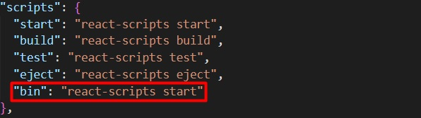

# BIN-DCAS
BIN-DCAS (Basic Interconnected Node Dental Clinic Appointment System) is a revision of my Capstone from PHP to React development.

# Front-End Development
### You must have installed:

> nodejs (https://nodejs.org/en/download) 

> react (npx create-react-app@latest *insert your app name*)

> react-router-dom (npm install react-router-dom)

### To run the Front-End, type in your terminal 'npm run bin'.
If you want to change this, go to 'package.json' and create a new script or edit the script that I have by default.

The below image is my default script. You can change it depending on your preferences.

